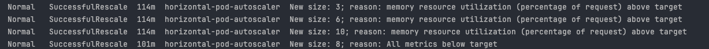

## Динамическое масштабирование контейнеров

Запускаем minikube вместе с metrics-server
1) `minikube start --addons=metrics-server`

minikube \
type: Control Plane \
host: Running \
kubelet: Running \
apiserver: Running \
kubeconfig: Configured 

Убеждаемся, что metrics-server запустился

2) `kubectl get pods -n kube-system | grep metrics-server`
 
`... metrics-server-84c5f94fbc-48mx8    1/1     Running ...`

Создаем deployment 

3) `kubectl apply -f deployment.yaml`

`... deployment.apps/test-app created`

Проверяем, что под с тестовым сервисом запустился

4) `kubectl get pods`

`... test-app-66c4fd475d-s58k5   1/1     Running ...`

Создаем сервис 

5) `kubectl apply -f service.yaml`

Проверяем, что сервис был создан

6) `kubectl get svc`

NAME           TYPE       CLUSTER-IP      EXTERNAL-IP   PORT(S)        AGE \
test-app-svc   NodePort   10.108.90.151   <none>        80:30775/TCP   96s

Создаем HorizontalPodAutoScaler. Я намеренно занизил порог memory Utilization, чтобы увидеть, 
что k8s controller создает реплики подов.

7) `kubectl apply -f hpa.yaml`

horizontalpodautoscaler.autoscaling/test-app-hpa created

Настраиваем локальное проксирование запросов в кластер minikube

8) minikube service test-app-svc --url

9) Запускаем нагрузку и видим, что horizontal-pod-autoscaler отрабатывает

